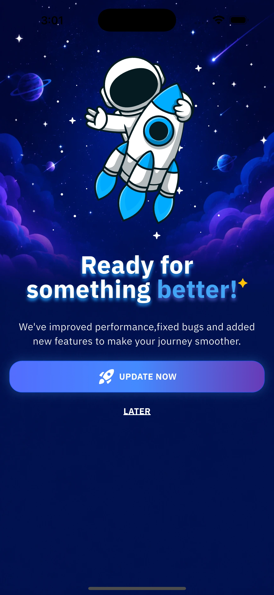
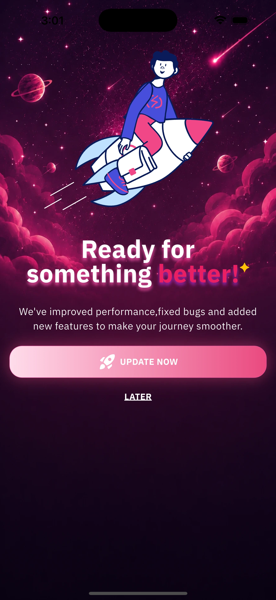
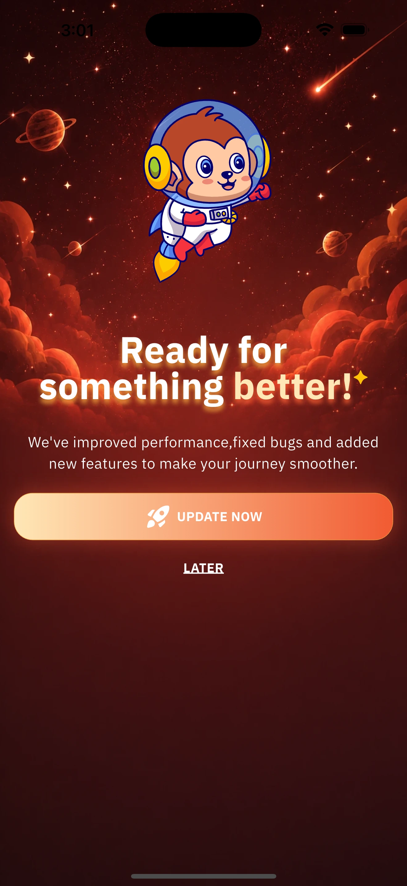
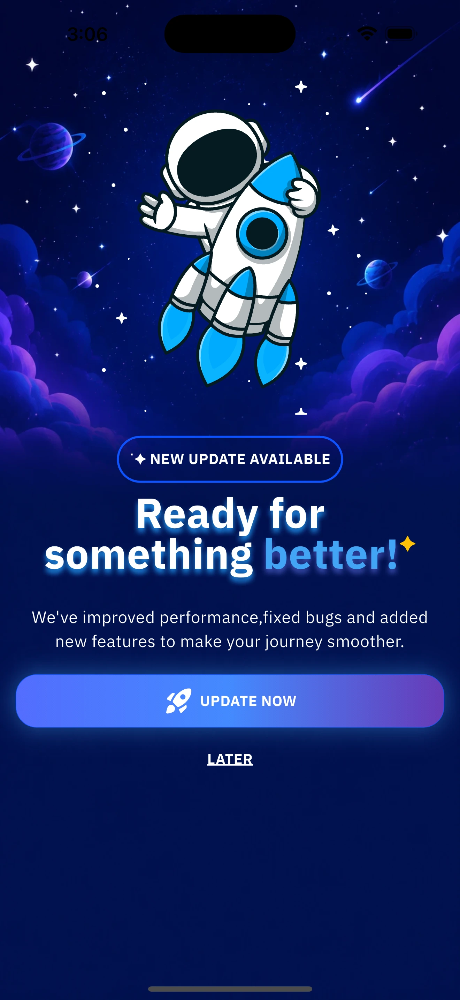
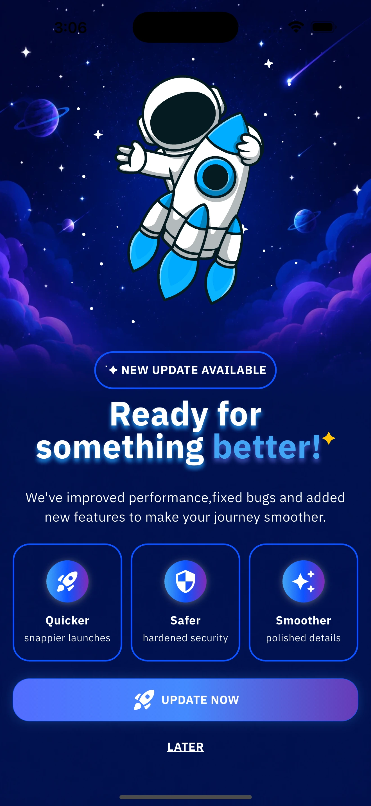
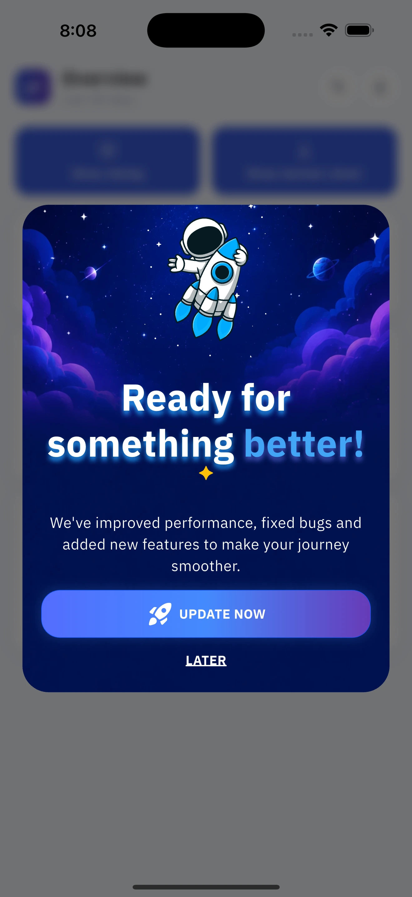
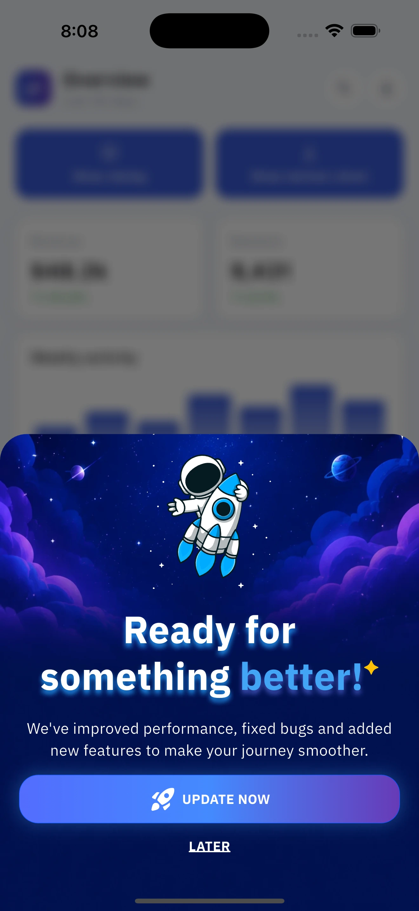

# app_upgrade_checker

**Tell your users a new version is out — and get them to install it.**

`app_upgrade_checker` checks the version running on the user's device against the latest
one you've released. If they're behind, it shows them a full-screen update screen
that takes them straight to the download.

### ✨ Why app_upgrade_checker?

You decide what "the latest version" is — read it from the store, or from your
own backend or a simple JSON file. And the screen your users see is a designed,
animated, fully customizable one.

|  |  |
|---|---|
| 🔌 **The version comes from wherever you want** | The store, or a URL you control — your API or a JSON file. With your own URL, **you** set the latest version, the oldest build still allowed, and whether updating is mandatory. |
| 🌍 **7 languages built in** | Arabic, English, Urdu, Spanish, Hindi, French, Indonesian — follows the device, with automatic RTL. |
| 🪟 **Screen, dialog or bottom sheet** | Show the update as a full screen, a dialog, or a bottom sheet. |
| 🧪 **Test mode** | See the update screen while you build — even if your app isn't on the store yet. Try any case: forced, optional, up-to-date, or failed. |
| 🎨 **3 full-screen designs** | Artwork, animation and a clear call to action — ready to ship as-is. |
| ✨ **7 entrance animations** | Automatically respect *reduce motion*. |

### The three designs

|                Cosmic (default)                 | RocketUp | SuperHero |
|:-----------------------------------------------:|:---:|:---:|
|  |  |  |
|           `AppUpgradeTheme.cosmic()`           | `AppUpgradeTheme.rocketUp()` | `AppUpgradeTheme.superHero()` |

### Optional blocks, on any design

Every design ships with a badge pill and three feature cards. Both are **off by
default** — one flag each brings in that design's own content.

| Default | `showBadge: true` | `showBadge` + `showFeatures` |
|:---:|:---:|:---:|
|  |  |  |

### Or as a dialog, or a bottom sheet

The same design, the same blocks — a different container. One field: `viewType`.

| `UpdateViewType.dialog` | `UpdateViewType.sheet` |
|:---:|:---:|
|  |  |
| `AppUpgradeTheme.cosmic(viewType: UpdateViewType.dialog)` | `AppUpgradeTheme.cosmic(viewType: UpdateViewType.sheet)` |

> **Platforms:** Android and iOS only. This is a mobile-focused package; it does
> not support web or desktop.

---

## Table of contents

**Getting started**
1. [How it works](#how-it-works)
2. [Install](#install)
3. [Quick start](#quick-start) — the store setup, in one line

**Choosing a source**

4. [Choosing where the version comes from](#choosing-where-the-version-comes-from)
   - [What is `AppConfig`?](#first-what-is-appconfig)
   - [1. Store sources — read the listing directly](#1-store-sources--read-the-listing-directly)
     - [ForcePolicy](#forcepolicy) — when is an update mandatory
   - [2. `CustomSource` — your backend or a JSON file](#2-customsource--your-backend-or-a-json-file)
     - [What your URL must return](#what-your-url-must-return)

**Styling**

5. [Theming the screen](#theming-the-screen)
    - [Every `AppUpgradeTheme` field](#every-appupgradetheme-field) — all 30
    - [Theme building blocks](#theme-building-blocks)
    - [Picking and building a theme](#picking-and-building-a-theme)
    - [Blocks: show, hide, reorder](#blocks-show-hide-reorder)
    - [Title, background and artwork](#title-background-and-artwork)
    - [View type: screen, dialog or sheet](#view-type-screen-dialog-or-sheet)
6. [Motion](#motion) — entrances, button glow, reduce motion

---

## How it works

`app_upgrade_checker` reads the **currently installed** version from the device, asks a source what the **latest** version is, and returns
one of three outcomes: an update is available (optionally forced), no update, or
the check failed.


The **source** is what you choose per platform. That's the whole API surface.

---

## Install

```yaml
dependencies:
  app_upgrade_checker: ^1.0.1
```

```dart
import 'package:app_upgrade_checker/app_upgrade_checker.dart';
```

---

## Quick start

This section covers the default setup — **your app is public on Google Play or
the App Store**. That needs no backend, no JSON, and no configuration.

### 1. The one line

```dart
await AppUpgrade.checkAndPrompt(context);
```

That's a complete, working integration. With no arguments it reads the store
listing for the current platform, compares it to the installed version, and — if
the user is behind — shows the built-in update screen.

### 2. Where to call it

**At app start**, from `initState`. It's safe there by design: it waits for the
first frame internally, so the `Navigator` is ready before anything is shown.

```dart
@override
void initState() {
  super.initState();
  AppUpgrade.checkAndPrompt(context); // no post-frame callback needed
}
```

You can also call it **from a button** ("Check for updates" in settings), or
after login — anywhere you have a `BuildContext`. Calling it twice is safe: the
second call reuses the first request and never stacks a second screen. To show a
spinner or disable that button meanwhile, read `AppUpgrade.isChecking`.

### 3. What you can pass to `checkAndPrompt`

`context` is the only required argument. **Everything else is optional** — this
table is about when you'd bother:

| Parameter | Type | Default | Pass it when… |
|---|---|---|---|
| `context` | `BuildContext` | **required** | always — it's how the screen is shown. |
| `config` | `AppConfig` | `AppConfig()` → the store | you want the version to come from **your backend or a JSON file** instead of the store → [choosing where the version comes from](#choosing-where-the-version-comes-from). |
| `theme` | `AppUpgradeTheme?` | Cosmic design | you want a **different look** — another design, your colors, your font → [theming](#theming-the-screen). |
| `preview` | `UpdatePreview?` | `null` | you're **still developing** and want to see the screen before your app is on the store. `UpdatePreview.optional()` / `.forced()` / `.upToDate()` / `.failure()` — each takes `versionName`, `releaseNotes`, `storeUrl`, `delay`. **Throws in release builds**, so it can't ship by accident. |
| `builder` | `Widget Function(UpdateAvailable)?` | `null` | you want **your own screen** instead of the built-in one: `builder: (update) => MyScreen(update)`. It receives the full result to render from. |
| `onError` | `void Function(UpdateCheckError)?` | `null` | you want failed checks reported to **Crashlytics / Sentry**. The user never sees an error either way. |

So a typical real-world call is still short:

```dart
await AppUpgrade.checkAndPrompt(
  context,
  theme: AppUpgradeTheme.rocketUp(),  // just a different design
);
```

**What happens in each case:** update found → the screen is shown. No update →
nothing happens. Check failed → the user sees nothing, and `onError` fires.

> **Your app isn't published yet?** Then there is no store listing to read, so
> the check finds nothing. Add `preview: UpdatePreview.optional()` (see the table
> above) to see the screen anyway.

---

### 4. The other entry point: `checkUpdate`

Use this when you **don't** want the built-in behaviour: it runs the same check
but shows nothing, handing you the answer so you can decide — a banner instead of
a screen, a postponed prompt, a silent background check. It takes `config` and
`preview` (no `context`, since it renders nothing) and returns an
`UpdateCheckResult`, which is always exactly one of three:

| Result | Meaning | What you can read from it |
|---|---|---|
| `UpdateAvailable` | the user is behind | the version, the store link, the release notes, whether it's forced — see the example below |
| `NoUpdate` | already up to date | — |
| `UpdateCheckError` | the check failed | `state` — `socket` / `timeout` / `server` / `unAuthorized` / `format`, so you can retry a dropped connection but report a bad response — and `message` |

```dart
final result = await AppUpgrade.checkUpdate();

switch (result) {
  case UpdateAvailable():
    // Every field is optional to use — read only what you need:
    result.isForceUpdate;            // bool   — is it mandatory?
    result.versionName;              // String?— "3.5.0"
    result.storeUrl;                 // String?— the download link
    result.releaseNotes;             // String?— what's new
    result.versionCode;              // int?   — CustomSource only, else null
    result.minSupportedVersionCode;  // int?   — CustomSource only, else null
    result.data;                     // the raw response

    if (context.mounted) await AppUpgrade.show(context, result);
    // ...or send them straight there: AppUpgrade.openStore(result.storeUrl!);
  case NoUpdate():
    break;
  case UpdateCheckError():
    debugPrint('check failed: ${result.message}');
}
```

> **`checkAndPrompt` is just these two combined** — `checkUpdate` to get the
> result, then `AppUpgrade.show` to display it.

---

**That's the quick start.** Everything below goes deeper: using your own backend
instead of the store, the JSON contract, theming the screen, animations, and the
full reference for every class.

---

## Choosing where the version comes from

### First: what is `AppConfig`?

`AppConfig` answers one question — **"where do I find out the latest version?"** —
and it answers it **separately for each platform**, because Android and iOS are
usually distributed differently.

```dart
AppConfig(
  android: /* a source */,   // null → check Google Play
  ios:     /* a source */,   // null → check the App Store
)
```

- Leave a platform **`null`** and it checks that platform's store with defaults.
  That's why `AppConfig()` — the default in Quick start — needs no arguments.
- Set a platform and you **replace** its source. Each platform gets **exactly
  one**.
- **You can mix them freely:** Android from your backend, iOS from the App Store,
  or any other combination.

There are two kinds of source to choose from:

| Source | Where the version comes from | You need |
|---|---|---|
| **`CustomSource`** | a URL **you** control — your API or a JSON file | a URL returning the [JSON contract](#what-your-url-must-return) |
| **`PlayStoreSource` / `AppStoreSource`** | the public store listing | nothing — your app just has to be published |

---

### 1. Store sources — read the listing directly

The simplest path, and the default: the device reads your **public store
listing** and takes the version from there. Nothing to host, nothing to maintain.
This is what runs when you call `checkAndPrompt(context)` with no `config`.

| Platform | Class | Reads from |
|---|---|---|
| Android | `PlayStoreSource` | the Google Play listing (an HTML read — unofficial) |
| iOS | `AppStoreSource` | Apple's iTunes Lookup API (official, public, no auth) |

**Use it when** your app is published publicly and you're happy to treat "the
version on the store" as the truth.

**One thing to know:** a store listing only exposes the version *name*
(`"3.2.0"`) — never a numeric build number. So there is nothing like
`minSupportedVersionCode` here; "is this update mandatory?" is decided by
[`forcePolicy`](#forcepolicy) instead.

```dart
// Both platforms on their store, with defaults — same as AppConfig()
const AppConfig();

// Or configure them:
AppConfig(
  android: const PlayStoreSource(forcePolicy: ForcePolicy.always),
  ios: const AppStoreSource(appleId: '123456789'),
)
```

**`PlayStoreSource` — what you can pass:**

| Parameter | Type | Default | Pass it when… |
|---|---|---|---|
| `forcePolicy` | `ForcePolicy` | `auto` | you want to change when an update becomes mandatory → [ForcePolicy](#forcepolicy). |
| `language` | `String?` | `null` | you want the release notes in a specific language (`hl=`), e.g. `'ar'`. |
| `country` | `String?` | `null` | your listing differs per storefront (`gl=`), e.g. `'SA'`. |

**`AppStoreSource` — what you can pass:**

| Parameter | Type | Default | Pass it when… |
|---|---|---|---|
| `forcePolicy` | `ForcePolicy` | `auto` | same as above → [ForcePolicy](#forcepolicy). |
| `appleId` | `String?` | `null` | the bundle-id lookup returns nothing. Pass the numeric Apple ID (trackId) instead. |
| `country` | `String?` | `null` | your app is published in a specific storefront, e.g. `'sa'`. Defaults to the US store. |


---

#### ForcePolicy

Controls when a store-method update is mandatory (ignored for
`CustomSource`, which carries its own flags):

| Value | Behaviour |
|---|---|
| `ForcePolicy.auto` (default) | Forced only on a **major** bump (`3.x.x` → `4.x.x`). |
| `ForcePolicy.always` | Every available update is forced. |
| `ForcePolicy.never` | Every update is optional. |

> Not published yet, or on a closed track? A store lookup has no listing to read
> — use a [`CustomSource`](#2-customsource--your-backend-or-a-json-file), or the
> `preview` parameter during development.

---

### 2. `CustomSource` — your backend or a JSON file

Point it at any URL you control and *you* decide the latest version, the oldest
build still allowed, and whether the update is mandatory. Use it for private or
non-store distribution (TestFlight, enterprise, Huawei, a direct APK), staged
rollouts, or whenever you need a real numeric build number — the stores only
expose a version *name* to a device.

The library sends a plain **GET** and expects the JSON below. A static file and a
real backend are identical here — only the URL differs, so a file on GitHub
Pages, Cloudflare, S3 or Netlify works with no server at all.

```dart
AppConfig(
  android: const CustomSource(url: 'https://api.you.com/app-version/android'),
  ios: const CustomSource(url: 'https://api.you.com/app-version/ios'),
)
```

| Parameter | Type | Default | Pass it when… |
|---|---|---|---|
| `url` | `String` | **required** | always. Use a **separate URL per platform** so each carries its own `storeUrl`. |
| `headers` | `Map<String,String>?` | `null` | your endpoint needs auth or any extra header — it's the only thing sent, so also handy for a segment header. Note the check often runs **before sign-in**. |
| `fallbackStoreUrl` | `String?` | `null` | you'd rather keep the download link in the app than in the JSON. Used only if the response has no `storeUrl`. |

> **Want the real store version?** Have **your backend** call the official store
> APIs ([Google Play Developer](https://developers.google.com/android-publisher),
> [App Store Connect](https://developer.apple.com/documentation/appstoreconnectapi))
> and return the JSON below. Both need a secret key, so they can only be called
> from a server — and it's the only way to get a numeric build number or a
> closed-track version.

#### What your URL must return

All fields are optional (and may be nested under a `data` key). The minimum that
works: `{ "latestVersionCode": 55, "storeUrl": "..." }`.

```json
{
  "latestVersionCode": 55,
  "latestVersionName": "3.5.0",
  "minSupportedVersionCode": 50,
  "storeUrl": "https://play.google.com/store/apps/details?id=com.you.app",
  "releaseNotes": "Performance improvements and bug fixes",
  "hasUpdate": true,
  "isForceUpdate": false
}
```

| Field | Type | Meaning |
|---|---|---|
| `latestVersionCode` | int | Build number of the latest release. Primary basis for comparison. |
| `latestVersionName` | string | Display version, e.g. `"3.5.0"` (also accepted as `versionName`). |
| `minSupportedVersionCode` | int | Builds **below** this are force-updated. |
| `storeUrl` | string | Where "Update now" sends the user. |
| `releaseNotes` | string | Shown in the update screen. |
| `hasUpdate` | bool | Optional override — if present, the library trusts it. |
| `isForceUpdate` | bool | Optional override — if present, the library trusts it. |

Your endpoint receives **nothing** — no body, no parameters, and the installed
version is never sent. The response is the same for everyone, so cache it hard.

> **A live example:** <https://alaakhaledahmed.github.io/app_upgrade_checker/version/android.json>
> — served from [`docs/version/`](docs/version/) in this repo and used by
> [`example/lib/main.dart`](example/lib/main.dart).

---

## Theming the screen

The screen carries no styling of its own — a `AppUpgradeTheme` supplies every
colour, text, asset and animation it draws, and which blocks it draws at all. So
restyling is never a subclass: you build a theme and pass it as `theme:`.

Three designs ship as named constructors; each fills all 30 fields with its own
values, and you override only what you need.

### Every `AppUpgradeTheme` field

Every field is optional; anything you omit keeps the design's own value.

| Field | Type | Default | Purpose |
|---|---|---|---|
| `lang` | `ThemeLang?` | the device's language, else `en` | Language of the **default** texts: `en`, `ar`, `ur`, `es`, `hi`, `fr`, `id`. `ar`/`ur` also switch the screen to RTL. Any text you set yourself wins over the translation. |
| `order` | `List<UpdateSection>` | visual → badge → title → version → description → features → buttons | Which blocks appear, and in what order. |
| `background` | `UpdateBackground` | per design | Solid colour, gradient, or an image. |
| `visual` | `UpdateVisual?` | per design | The top artwork — Lottie, image, icon, or your widget. |
| `badge` | `UpdateBadgeStyle` | per design | The pill above the headline. |
| `title` | `UpdateTitle` | per design | The two-line headline. |
| `version` | `UpdateVersionStyle` | default | The version pill. |
| `description` | `UpdateTextStyle` | per design | The body paragraph. |
| `fallbackDescription` | `String` | `'A new version is ready to install.'` | Used when neither the theme nor the response has text. |
| `features` | `List<UpdateFeature>` | per design | The cards. |
| `updateButton` | `UpdateButtonStyle` | per design | Primary button. |
| `laterButton` | `LaterButtonStyle` | default | Dismiss link. |
| `showVisual`, `showTitle`, `showDescription`, `showUpdateButton`, `showLaterButton` | `bool` | `true` | On by default. |
| `showBadge`, `showFeatures`, `showVersion` | `bool` | **`false`** | Off by default — one flag brings in the design's own content. |
| `contentPadding` | `EdgeInsetsGeometry` | `horizontal: 15` | Padding around the column. |
| `sectionSpacing` | `double` | `20` | Gap between blocks. |
| `featureSpacing` | `double` | `10` | Gap between feature cards. |
| `scrollable` | `bool` | `true` | Keep `true` — prevents overflow on short screens. |
| `alignment` | `CrossAxisAlignment` | `center` | Horizontal alignment. |
| `fontFamily` | `String?` | `null` | Your font; `null` uses the bundled one. |
| `textDirection` | `TextDirection?` | `null` | `null` follows the host app; set `rtl` to force it. |
| `viewType` | `UpdateViewType` | `screen` | The form it takes: `screen` (full page), `dialog` (centred card), `sheet` (bottom sheet). The blocks, the order and the `show*` flags are identical in all three — `dialog` and `sheet` lift the artwork into a header above the card and cap their height at 85% of the screen, scrolling inside it. |
| `entrance` | `UpdateEntrance` | per design | How the **full screen** arrives: `.warpIn()`, `.rocketPull()`, `.liftoff()`, `.descend()`, `.slideUp()`, `.fade()`, `.none()`. Ignored when `viewType` is `dialog` or `sheet`. |
| `dialogEntrance` | `DialogEntrance` | `popIn()` | How the **dialog and sheet** arrive: `.popIn()` — zooms up to full size, `.slideUp()`, `.fade()`, `.none()`. Ignored when `viewType` is `screen`. A separate type from `entrance` because a card cannot move its backdrop and content apart the way a full screen can — so a screen-only entrance can't be passed here by mistake. |
| `pulse` | `UpdatePulse?` | per design | Button glow. `copyWith(noPulse: true)` switches it off. |

### Theme building blocks

| Class | Key fields |
|---|---|
| `UpdateTitle` | `firstLine`, `secondLine`, `highlight`, `sparkle`, `color`, `highlightColor`, `sparkleColor`, `shadowColor`, `fontSize`, `fontWeight`, `textAlign`, `textDirection`, **`firstLineHeight`** — the gap between the two lines, as a multiple of `fontSize` (default `1.0`). Lower it to pull them together, but note it also tightens a line that wraps, so a long headline can overlap itself. |
| `UpdateBadgeStyle` | `text` (`'NEW UPDATE AVAILABLE'`), `prefix` (`'˙✦ '`), `textColor`, `backgroundColor`, `borderColor`, `borderWidth` (`2`), `radius` (`50`), `padding`, `margin`. |
| `UpdateButtonStyle` | `text` (`'UPDATE NOW'`), `icon` (`rocket_launch_rounded`), `iconWidget`, `iconColor`, `gradient`, `backgroundColor`, `textColor`, `fontSize`, `fontWeight`, `borderColor`, `radius`, `padding`. |
| `LaterButtonStyle` | `text`, `color`, `fontSize`, `fontWeight`, underline styling. |
| `UpdateFeature` | `icon` or `iconWidget`, `title`, `subtitle`, `iconColor`, `iconSize`, `iconGradient`, card border and background. |
| `UpdateTextStyle` | `text`, `color`, `fontSize`, `fontWeight`, `textAlign`. |
| `UpdateVersionStyle` | `text`, colours, border, radius, padding. |
| `UpdateBackground` | `.solid(color)`, `.gradient(colors)`, `AssetBackground(path, package:, color:)`, `.none()`. |
| `UpdateVisual` | `.lottie(path, package:)`, `.asset(path, package:)`, `.network(url)`, `.icon(icon)`, `.custom(builder)` — plus `heightFactor` / `height`. |
| `UpdateEntrance` | `.fade()`, `.slideUp()`, `.rocketPull()`, `.descend()`, `.warpIn()`, `.liftoff()`, `.none()` — each takes a `duration`. Full screen only. |
| `DialogEntrance` | `.popIn()` (a zoom up to full size — takes `fromScale`, default `0.85`, and `overshoot`, default `true`), `.slideUp()`, `.fade()`, `.none()`. Dialog and sheet only. |
| `UpdateViewType` | `screen`, `dialog`, `sheet` — the enum used by `viewType`. |
| `UpdatePulse` | The breathing glow behind the primary button; `null` on the theme switches it off. |
| `UpdateSection` | The enum used by `order`: `visual`, `badge`, `title`, `version`, `description`, `features`, `updateButton`, `laterButton`. |

> **One rule for every style above.** Whatever you set is yours; everything you
> leave out keeps the design's value. So changing a label never costs you its
> colours, gradient or border — and to change one of *those*, you just name it:
>
> ```dart
> updateButton: const UpdateButtonStyle(text: 'Get it now'),        // Cosmic's gradient kept
> updateButton: const UpdateButtonStyle(backgroundColor: Colors.green), // flat green instead
> ```
>
> A `features` list works the same way, pairing your cards with the design's
> **by position**; any extra card you add is kept as-is.

### Picking and building a theme

```dart
AppUpgradeTheme.cosmic()      // astronaut over a blue starfield
AppUpgradeTheme.rocketUp()    // rocket over a pink starfield
AppUpgradeTheme.superHero()   // cartoon hero over a red starfield
```

```dart
final myTheme = AppUpgradeTheme.cosmic(
  title: const UpdateTitle(
    firstLine: 'Ready for', secondLine: 'something', highlight: 'better!'),
  showFeatures: true,
  updateButton: const UpdateButtonStyle(text: 'Get it now'), // keeps the design's gradient + icon
  lang: ThemeLang.ar,               // default texts in Arabic + RTL
  fontFamily: 'Cairo',              // the family: from YOUR pubspec.yaml
);

await AppUpgrade.checkAndPrompt(context, theme: myTheme);

// inline, or a variant of one you already have:
await AppUpgrade.checkAndPrompt(context, theme: AppUpgradeTheme.rocketUp());
await AppUpgrade.checkAndPrompt(context, theme: myTheme.copyWith(showBadge: false));
```

### Blocks: show, hide, reorder

`visual` → `badge` → `title` → `version` → `description` → `features` →
`updateButton` → `laterButton`

`showBadge`, `showFeatures` and `showVersion` are **off** by default; the rest
are on. Turning one on brings in that design's own content
([pictured at the top](#optional-blocks-on-any-design)):

```dart
AppUpgradeTheme.cosmic(
  showBadge: true,          // the design's own badge text
  showFeatures: true,       // the design's own three cards
  showDescription: false,   // drop the paragraph

  order: const [            // reorder or drop blocks
    UpdateSection.visual,
    UpdateSection.features, // cards above the headline
    UpdateSection.title,
    UpdateSection.updateButton,
  ],
);
```

### Title, background and artwork

All three are theme fields, so you set them where you build the theme:

```dart
AppUpgradeTheme.cosmic(
  // Headline: line one, line two, and the highlighted last word.
  title: const UpdateTitle(
    firstLine: 'Ready for', secondLine: 'something', highlight: 'better!'),

  // Behind everything — pick exactly one:
  background: const UpdateBackground.solid(Color(0xff01114f)),

  // The artwork on top — pick exactly one:
  visual: const UpdateVisual.lottie('assets/rocket.json', package: null),
);
```

**Every option for each field:**

```dart
// title — the same three-part shape in any language
const UpdateTitle(
  firstLine: 'Ready for', secondLine: 'something', highlight: 'better!');
const UpdateTitle(
  firstLine: 'هل أنت مستعد', secondLine: 'لشيء', highlight: 'أفضل!');

// background
const UpdateBackground.solid(Color(0xff01114f));
const UpdateBackground.gradient(LinearGradient(colors: [...]));
const UpdateBackground.asset('assets/bg.png', package: null, color: Color(0xff01114f));
const UpdateBackground.network('https://…', color: Color(0xff01114f));
const UpdateBackground.none();

// visual
const UpdateVisual.lottie('assets/anim.json', package: null);
const UpdateVisual.asset('assets/hero.png', package: null);
const UpdateVisual.network('https://…');
const UpdateVisual.icon(Icons.system_update_rounded, circleGradient: [...]);
UpdateVisual.custom((context) => MyWidget());
```

- `package: null` — the asset is in **your** app, not the package's.
- On an image background, `color` fills the rest of the screen: match the
  image's own edge so there's no visible seam.
- `textDirection: TextDirection.rtl` forces RTL in an app with no RTL locale.
- No `fontFamily` → the bundled font (IBM Plex Sans Arabic, Regular + Bold).
- Pull the headline's two lines closer with
  `UpdateTitle(firstLineHeight: 0.7)` — keep it near `1.0` for long text.
- Borrow a palette from another design:
  `AppUpgradeTheme.cosmic(background: RocketUpDesign.backgroundStyle)`.

### View type: screen, dialog or sheet

One field decides the form. Everything else about the theme is unchanged:

```dart
AppUpgradeTheme.cosmic()                                    // full screen (default)
AppUpgradeTheme.cosmic(viewType: UpdateViewType.dialog)     // centred dialog
AppUpgradeTheme.cosmic(viewType: UpdateViewType.sheet)      // bottom sheet
```

The same blocks, the same `order`, the same `show*` flags in all three — so
everything above applies unchanged:

```dart
AppUpgradeTheme.cosmic(
  viewType: UpdateViewType.dialog,
  showBadge: true,        // works exactly as it does full-screen
  showFeatures: true,
);
```

Two things the dialog and the sheet do differently:

- **the artwork becomes a header.** It's drawn on the background above the card,
  wherever `order` places it — so the card below holds only text and buttons.
  `showVisual: false` drops the header entirely and leaves a text-only card.
- **they cap their own height** at 85% of the screen and scroll inside it, so a
  long release note or a large system font can't push them off-screen.

Switching an existing theme over is one line, and each form keeps its own motion:

```dart
final theme = AppUpgradeTheme.cosmic();
theme;                                              // a full screen
theme.copyWith(viewType: UpdateViewType.dialog);    // the same, as a dialog
```

> Currently wired on **Cosmic**. `rocketUp()` and `superHero()` still render as
> full screens with their own designs.

---

## Motion

### Entrances — full screen

How the **full screen** arrives, picked per design like any other value. For the
dialog and the sheet see [Entrances — dialog and sheet](#entrances--dialog-and-sheet).

```dart
AppUpgradeTheme.cosmic(entrance: const UpdateEntrance.rocketPull());
```

| Entrance | Motion |
|---|---|
| `rocketPull()` | panel rises while the artwork leads it, so the artwork appears to pull the page |
| `warpIn()` | eases down from a slight over-scale, like settling after a jump |
| `liftoff()` | the backdrop sinks while content holds still — the camera seems to climb |
| `descend()` | arrives from above |
| `slideUp()` | plain slide from the bottom |
| `fade()` | cross-fade |
| `none()` | no entrance, shown instantly |

Defaults: Cosmic `warpIn`, RocketUp `rocketPull`, SuperHero `slideUp`. All are
tunable (`duration`, `parallax`, `stagger`, …).

Every entrance runs for **900ms** by default and takes a `duration` of its own:
`UpdateEntrance.warpIn(duration: Duration(milliseconds: 500))`.

### Entrances — dialog and sheet

A card cannot move its backdrop and its content apart the way a full screen can,
so the dialog and the sheet have their own, separate set — passed as
`dialogEntrance`:

```dart
AppUpgradeTheme.cosmic(
  viewType: UpdateViewType.dialog,
  dialogEntrance: const DialogEntrance.slideUp(),
);
```

| Entrance | Motion |
|---|---|
| `popIn()` | zooms up from smaller to full size while fading in — **the default** |
| `slideUp()` | rises from the bottom edge |
| `fade()` | cross-fade |
| `none()` | shown instantly |

`popIn()` starts at `fromScale: 0.85` and passes full size by a hair before
settling — pass `overshoot: false` for a clean stop, or another `fromScale` for a
bigger or smaller zoom.

Because the two are **different types**, a screen-only entrance cannot reach a
dialog by mistake — the compiler rejects it. Each field is simply ignored in the
form it does not apply to, so one theme can carry both:

```dart
AppUpgradeTheme.cosmic(
  entrance: const UpdateEntrance.liftoff(),        // used as a screen
  dialogEntrance: const DialogEntrance.popIn(),    // used as a dialog or sheet
);
```

### Button glow

A slow breathing glow keeps the eye on the action:

```dart
AppUpgradeTheme.cosmic(
  pulse: const UpdatePulse(period: Duration(milliseconds: 1800)),
);

AppUpgradeTheme.cosmic().copyWith(noPulse: true);   // off
```

### Reduce motion

Every entrance degrades to a short fade and the glow is suppressed when the
platform's "reduce motion" accessibility setting is on. That setting exists for
motion sensitivity, so it is honoured automatically and cannot be overridden.
